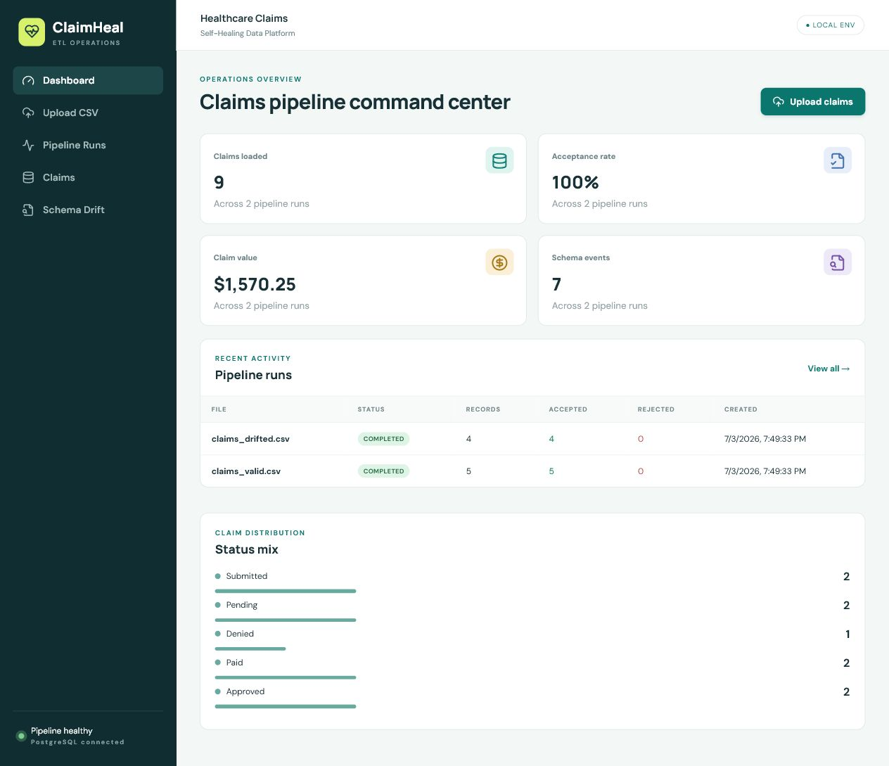
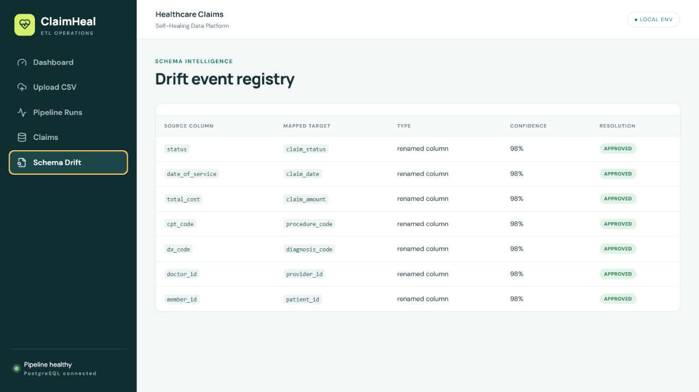

# Healthcare Claims Self-Healing ETL Pipeline

[](https://github.com/mariapreethi-12/healthcare-claims-self-healing-etl/actions/workflows/ci.yml)

A full-stack data platform that detects schema drift in healthcare claims CSVs, proposes AI-assisted repairs, keeps a human in the approval loop, validates data quality, and loads clean claims into PostgreSQL with a complete rejection and schema-event audit trail.

The project is deliberately safe to demo: **OpenAI and Ollama are optional**. The mapping chain is OpenAI → local Ollama → deterministic fallback. With neither configured, the included drift patterns still work offline.



<details>
<summary>Schema drift audit view</summary>



</details>

## What it demonstrates

- Schema contract enforcement and drift detection
- OpenAI-assisted mapping with automatic local fallback
- Local Ollama inference option for private, offline schema repair
- Human approval before applying repairs
- Row-level validation with accepted/rejected data lineage
- Transactional PostgreSQL persistence
- Operational metrics and searchable claims UI
- Typed FastAPI and React TypeScript boundaries
- Containerized local environment and automated tests

## Architecture

```text
                     ┌──────────────────────────────┐
CSV upload ─────────▶│ FastAPI ingestion endpoint   │
                     └──────────────┬───────────────┘
                                    │ parse + fingerprint
                     ┌──────────────▼───────────────┐
                     │ Schema drift detector        │
                     │ exact / alias / unknown      │
                     └──────────────┬───────────────┘
                                    │
                  ┌─────────────────▼──────────────────┐
                  │ Mapping engine                     │
                  │ OpenAI → Ollama → mock fallback    │
                  └─────────────────┬──────────────────┘
                                    │ human approval for drift
                     ┌──────────────▼───────────────┐
                     │ Pandas-style ETL validation  │
                     │ types, required, domain, DQ  │
                     └────────┬──────────────┬──────┘
                              │ valid        │ invalid
                    ┌─────────▼──────┐ ┌─────▼─────────────┐
                    │ claims        │ │ rejected_claims   │
                    └─────────┬──────┘ └─────┬─────────────┘
                              └───────┬───────┘
                              ┌───────▼────────┐
                              │ React console │
                              └────────────────┘
```

`pipeline_runs` stores upload metadata, raw staged rows, mapping state, and counts. `schema_events` records each detected rename/unknown field. `claims` is the curated table. `rejected_claims` preserves the original row and all validation reasons.

## Quick start with Docker

Requirements: Docker Desktop with Compose.

```bash
git clone <your-repository-url>
cd healthcare-claims-self-healing-etl
docker compose up --build
```

Open:

- Web app: http://localhost:3000
- API documentation: http://localhost:8000/docs
- API health: http://localhost:8000/health

Start with `sample-data/claims_drifted.csv`. The app will detect seven renamed fields, propose the canonical mapping, and pause for approval. Then try `claims_mixed_quality.csv` to see row-level rejection reasons reflected in metrics.

Stop services with `docker compose down`. Add `-v` only when you intentionally want to delete the PostgreSQL volume.

## Optional AI mapping

Copy `.env.example` to `.env` and set:

```dotenv
OPENAI_API_KEY=your-key
OPENAI_MODEL=gpt-4o-mini
```

The backend asks the model only for a constrained JSON column mapping. It validates every source and target against the actual CSV and canonical contract. If the request fails, times out, or returns invalid data, the local mapper takes over and marks the run `mock_fallback`.

No key is needed for the supplied examples.

### Local Ollama

Start the stack with the Ollama profile and point the backend at the local service:

```powershell
$env:OLLAMA_BASE_URL="http://ollama:11434"
docker compose --profile ollama up --build
```

The `ollama-init` container pulls `llama3.2:3b` into a persistent volume. Override it with `OLLAMA_MODEL`. If Ollama is unavailable or returns invalid JSON, the deterministic mapper takes over automatically.

## Local development

Backend (use PostgreSQL from Docker or override `DATABASE_URL`):

```bash
cd backend
python -m venv .venv
# Windows: .venv\Scripts\activate
# macOS/Linux: source .venv/bin/activate
pip install -r requirements-dev.txt
set DATABASE_URL=sqlite:///./claims-dev.db
uvicorn app.main:app --reload
```

PowerShell uses `$env:DATABASE_URL="sqlite:///./claims-dev.db"` instead of `set`.

Frontend:

```bash
cd frontend
npm install
npm run dev
```

Vite proxies `/api` to `localhost:8000`.

## Data-quality rules

All eight canonical fields are required. The pipeline also enforces:

- Unique `claim_id` across loaded claims
- Non-negative numeric `claim_amount`
- ISO `YYYY-MM-DD` claim dates
- Diagnosis and procedure code character/length checks
- Status domain: `submitted`, `pending`, `approved`, `denied`, `paid`, or `rejected`
- Complete one-to-one source-to-target mapping

Drifted uploads remain staged as `awaiting_approval`; exact canonical schemas process immediately. Approval performs validation and persistence in one database transaction.

## API

| Method | Endpoint | Purpose |
|---|---|---|
| `POST` | `/api/upload` | Upload, fingerprint, and stage a CSV |
| `GET` | `/api/runs` | List pipeline runs |
| `GET` | `/api/runs/{run_id}` | Run details, mapping, and drift events |
| `POST` | `/api/runs/{run_id}/approve-mapping` | Approve mapping and execute ETL |
| `GET` | `/api/claims` | Paginated/searchable accepted claims |
| `GET` | `/api/metrics` | Dashboard aggregates |
| `GET` | `/api/schema-events` | Schema drift audit history |

FastAPI exposes request/response examples and live schemas at `/docs`.

## Tests

```bash
cd backend
pip install -r requirements-dev.txt
pytest
```

Tests run against an isolated SQLite database and cover known drift mapping, invalid types/dates, upload and approval, accepted/rejected counts, metrics, and file-type validation.

GitHub Actions runs the backend suite and the frontend TypeScript/Vite production build on every push and pull request.

## Repository layout

```text
backend/
  app/
    main.py        API routes
    mapping.py     OpenAI + deterministic mapping strategy
    pipeline.py    mapping and row validation
    models.py      SQLAlchemy persistence model
  tests/
frontend/
  src/
    App.tsx        routes and operations pages
    api.ts         typed API client
sample-data/
docker-compose.yml
```

## Production next steps

For a real PHI workload: replace staged JSON with encrypted object storage, add OAuth/OIDC and tenant isolation, redact logs, encrypt data with managed keys, add Alembic migrations, use a task queue for large files, add idempotency keys, stream parsing, quarantine retention rules, observability, and complete HIPAA security/compliance review. The sample files are synthetic and contain no PHI.

## Resume bullets

- Built a full-stack healthcare claims ETL platform with FastAPI, React/TypeScript, PostgreSQL, and Docker, implementing schema-drift detection, human-approved self-healing mappings, and end-to-end data lineage.
- Designed an optional OpenAI mapping adapter with constrained JSON output and deterministic fallback, enabling reliable local execution while supporting semantic repair of unfamiliar source schemas.
- Implemented row-level data-quality controls and transactional accepted/rejected routing, exposing operational KPIs, schema-event audits, and searchable curated claims through typed REST APIs.
